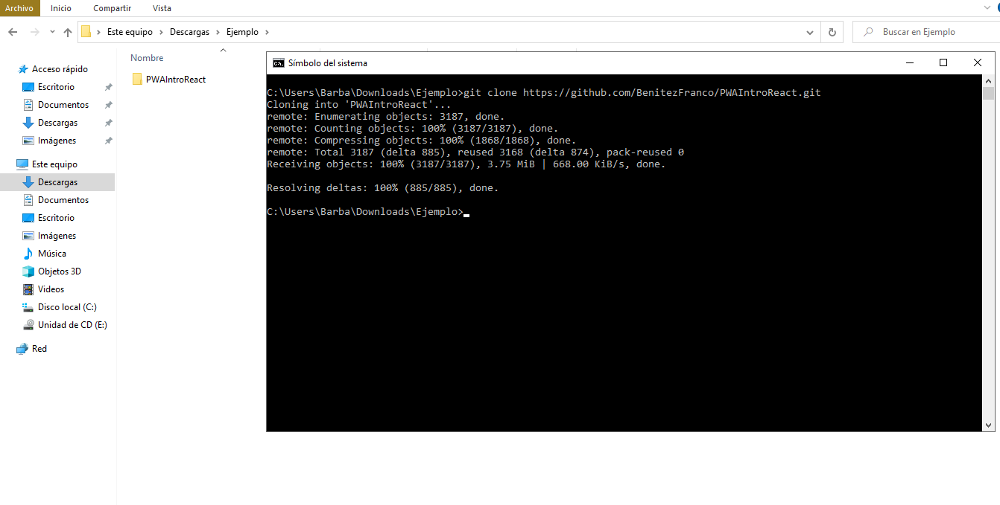
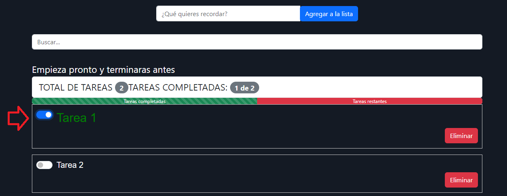
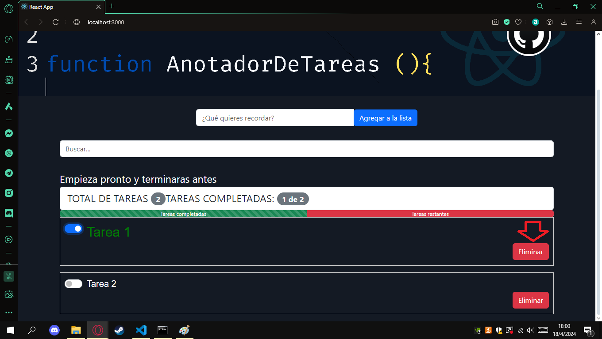
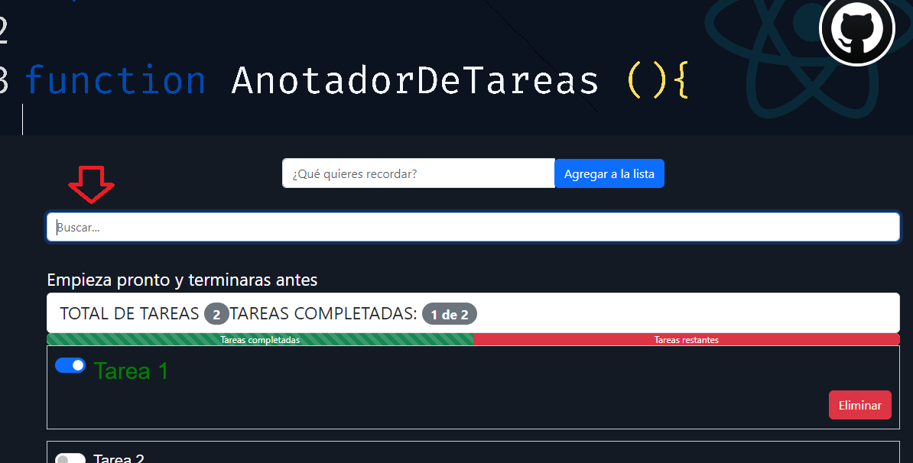

<h1> TP Lista de Tareas (To-Do List)- PROGRAMACIÓN WEB AVANZADA - REACT</h1>

<h3> Grupo x1: </h3>
<ul>
    <li> Benitez Franco
    <li> Corrales Abigail
</ul>

<h3> Descripción de la aplicación </h3>

La aplicación funciona como un anotador de tareas por hacer, que permite al usuario agregar nuevas tareas, marcar tareas como completadas y eliminar tareas.
Cada tarea tiene como característica una descripción (lo que dice la tarea) y un estado (completada o no completada).
La aplicación muestra todas las tareas en una lista y realiza un seguimiento. Muestra el número total y el número de tareas completadas.
Contiene un buscador, que permite al usuario agregar una parte del texto de la tarea y con ello filtra todas las tareas que obtengan una coincidencia.
Si no hay tareas para mostrar, da un mensaje al usuario de que ya completó todas sus tareas y que está listo para descansar.

<h3>Instalación paso por paso</h3>
<ol>
    <li>
    Para instalar la aplicación nos posicionamos con una terminal en la carpeta donde queremos descargarla y ejecutamos el siguiente comando:
    git clone https://github.com/BenitezFranco/PWAIntroReact.git
    
    </li>
    <li>
    Una vez clonado nos posisionamos con en la carpeta PWAIntroReact\listatareas y usamos el comando npm i
    
    </li>
    <li>
    Después de que todo se instala usamos el comando npm start
      
    </li>
    <li>
    Y finalmente se abre la app en el navegador predeterminado
    
    </li>
</ol>

<h3>Guia de uso:</h3>
<ul>
    <li>
<b>Cómo agregar una tarea:</b>
Escribimos en la casilla que dice "¿que quieres recordar?" y cliqueamos en "Agregar a la lista"

</li>
<li>
<b>Cómo marcar que si se completo o no la tarea:</b>
Se cliquea en el Checkbox, si la letra es de color blanco quiere decir que la tarea esta incompleta o si el color verde la tarea esta completa.

</li>
<li>
<b>Cómo eliminar una tarea:</b>
Cliqueamos en el botón que dice eliminar

</li>
<li>
<b>Cómo buscar:</b>
Para buscar escribimos en la casilla "Busca.."

</li>
</ul>

<h3> Preguntas y respuestas del TP</h3>

2)a)i)Explicar la función de los siguientes archivos iniciales: index.js, App.js, index.css y package-json.js

 
<ul>
<li>index.js: Es donde se renderiza el componente principal de la aplicación en el DOM del navegador.</li>
<li>
App.js: Suele contener el componente principal de la aplicación. Es donde se define la estructura general de la aplicación y dónde se organizan otros componentes de React.
</li>
<li>
index.css: Este archivo es donde se definen los estilos globales para la aplicación. Los estilos se aplicarán a todos los componentes de la aplicación, a menos que se sobrescriban en los archivos de estilos de componentes individuales.
</li>
<li>
package.json: Es un descriptor del proyecto que contiene información sobre él, como su nombre, versión, dependencias, scripts de inicio, etc. También se incluyen las dependencias del proyecto, incluidas las bibliotecas de React y otras bibliotecas externas que la aplicación pueda necesitar para funcionar correctamente.
</li>
</ul>

