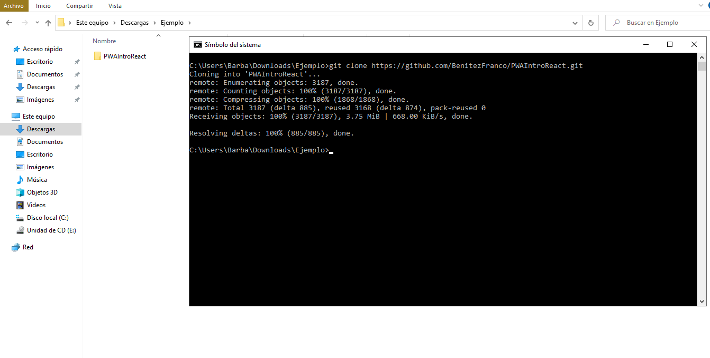
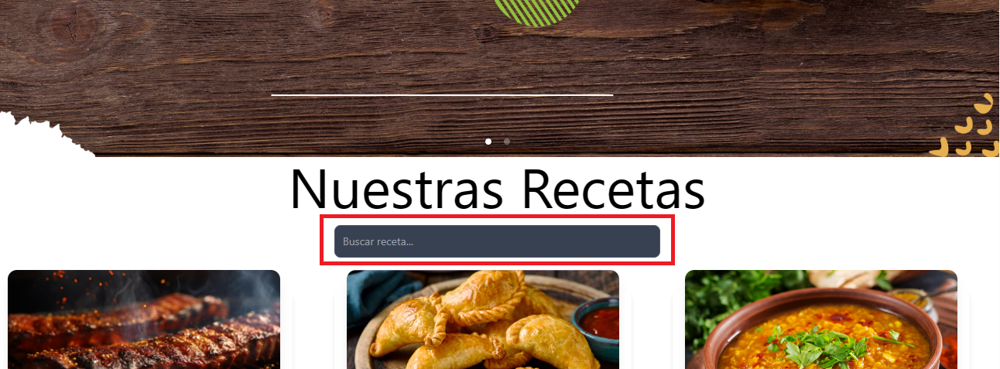
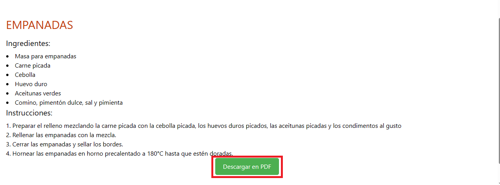

<h1> TP 2 Aplicación con Múltiples Páginas - PROGRAMACIÓN WEB AVANZADA - REACT</h1>

<h3> Grupo x1: </h3>
<ul>
    <li> Benitez Franco
    <li> Corrales Abigail
</ul>

<h3> Descripción de la aplicación </h3>

La aplicación funciona como una biblioteca de recetas en la que se puede buscar una en especifico con un buscador, leer como se hace y descargar un pdf con la receta

<h3>Instalación paso por paso</h3>
<ol>
    <li>
    Para instalar la aplicación nos posicionamos con una terminal en la carpeta donde queremos descargarla y ejecutamos el siguiente comando:
    git clone https://github.com/BenitezFranco/PWAIntroReact.git
    
    </li>
    <li>
    Una vez clonado nos posisionamos con en la carpeta PWAIntroReact\recetas con cd PWAIntroReact\recetas y usamos el comando npm i
    
    </li>
    <li>
    Después de que todo se instala usamos el comando npm start
    
    </li>
    <li>
    Y finalmente se abre la app en el navegador predeterminado
    
    </li>
</ol>

<h3>Guia</h3>
<ul>
<li>Para buscar escribimos en Buscar receta...:

</li>
<li>Como acceder a la receta:

</li>
<li>Como descargar la receta en pdf(en la pagina de la receta):

</li> 
</ul>
